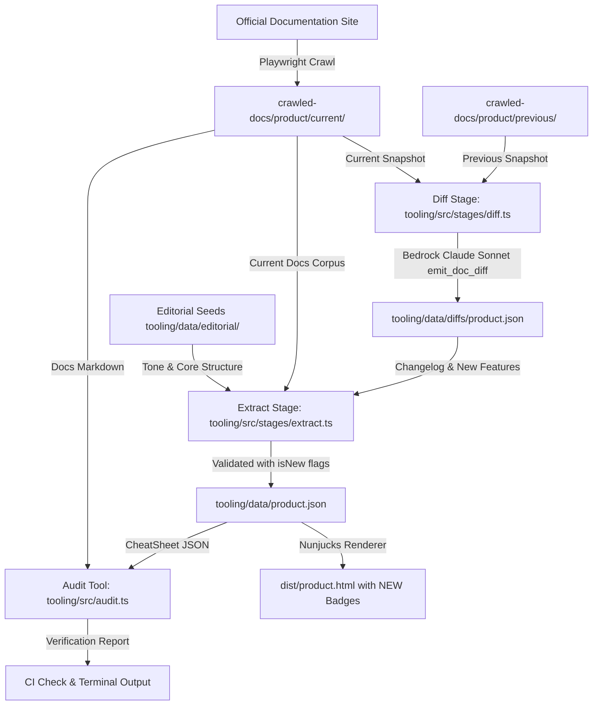

# Requirements

### Overview & Goals
The **JetBrains AI Cheat Sheets** project generates static, multi-column cheat sheets for JetBrains AI products (Junie, AI Assistant, JetBrains Air, and Central Console) by crawling official documentation, distilling content via Claude on Amazon Bedrock, and rendering static HTML pages.

Currently, when documentation is updated or new product features are released, there is no automated mechanism to detect what has changed between doc versions. As a result, newly introduced features and slash commands — such as Junie's `/local` (local model inference on Apple Silicon) and `/goal` (goal-oriented planning/execution) — are not automatically captured or emphasized in the cheat sheets or editorial seeds.

This plan establishes an automated **Documentation Diffing & Feature Identification Pipeline** across all JetBrains AI products. It compares consecutive documentation snapshots, extracts newly introduced features and commands using semantic LLM comparison, automatically enriches the extraction stage, updates the editorial seeds, and highlights new capabilities with visual `NEW` badges on the rendered cheat sheets.

---

### Scope

#### In Scope
- **Snapshot Versioning**: Managing versioned snapshot directories (`crawled-docs/<product>/snapshots/`, `current/`, `previous/`) during crawl operations.
- **LLM Semantic Diff Stage (`diff.ts`)**: A new pipeline stage that compares previous vs current markdown doc snapshots and emits structured JSON changelogs (`tooling/data/diffs/<product>.json`).
- **Feature Detection & Command Extraction**: Identifying newly introduced slash commands (e.g., `/local`, `/goal`, `/demo`, `/debug`), CLI flags, subagents, and major capabilities.
- **Extraction Pipeline Enrichment (`extract.ts`)**: Ingesting the diff changelog into the LLM extraction prompt, ensuring new items populate Section 2 ("Latest & EAP") and domain sections with `isNew: true`.
- **Editorial Seed Updates**: Updating `tooling/data/editorial/junie.md` and related seed files with missing commands (`/local`, `/goal`, etc.).
- **Visual "NEW" Badges**: Extending `CheatSheetSchema` and `cheatsheet.njk` to render styled `NEW` badges next to freshly identified commands across all product themes.
- **Command Coverage Audit**: A verification utility to scan crawled markdown for slash commands and verify their inclusion in `tooling/data/<product>.json`.

#### Out of Scope
- Modifying AWS S3 / CloudFront infrastructure deployments (`infra/`).
- Replacing the core Anthropic Claude model on Amazon Bedrock.
- Changing third-party documentation hosting platforms.

---

### User Stories
- **As a developer using JetBrains AI tools**, I want the cheat sheets to immediately highlight the newest slash commands and capabilities (like `/local` and `/goal`) so I always know about the latest features.
- **As a cheat sheet maintainer**, I want the pipeline to automatically detect what is new between doc crawls and inject those changes into the extraction stage, eliminating manual guesswork.
- **As a QA or release engineer**, I want an automated audit command that verifies whether any documented slash commands or CLI flags are missing from the generated cheat sheets.

---

### Functional Requirements
1. **Versioned Snapshot Management**: When `npm run crawl` runs, it preserves the previous snapshot and saves the new crawl into `crawled-docs/<product>/snapshots/<timestamp>/` and updates `current/` and `previous/`.
2. **Semantic Diffing Stage (`tooling/src/stages/diff.ts`)**: A dedicated stage comparing `previous` and `current` docs using Claude Sonnet to generate a structured `DocDiffChangelog` (`tooling/data/diffs/<product>.json`).
3. **Changelog Data Schema**: Structured schema capturing `newFeatures`, `updatedFeatures`, `deprecatedFeatures`, and `newCommandsAndFlags`.
4. **Enriched Extraction**: `tooling/src/stages/extract.ts` consumes `tooling/data/diffs/<product>.json` and instructs Claude to prioritize new features in Section 2 ("Latest & EAP"), place them in domain sections, and flag rows with `isNew: true`.
5. **UI "NEW" Badges**: `tooling/templates/cheatsheet.njk` renders a styled `.badge-new` pill tag when `row.isNew` is true, themed per product (Synthetic Green for Junie/default, Cyan/Mint for Air, Violet/Blue for AI Assistant).
6. **Command Audit Tool**: `tooling/src/audit.ts` (executable via `npm run audit:commands`) parses all slash commands (`/[a-z0-9_-]+`) from crawled docs and reports any command missing from `tooling/data/*.json`.

---

### Non-Functional Requirements
- **Determinism & Schema Safety**: All diff and cheat sheet outputs validated with Zod schemas before persisting.
- **Performance**: Semantic diffing executes in a single Bedrock LLM call per product, maintaining fast pipeline runs.
- **Backward Compatibility**: If no previous snapshot exists, the pipeline falls back gracefully by inspecting the current crawl for EAP/new tags without failing.

# Technical Design

### Current Implementation
The existing pipeline in `tooling/` operates in three linear stages:
1. **`stages/crawl.ts`**: Crawls URLs defined in `ProductConfig.crawlSeeds` and writes flat markdown files to `crawled-docs/<product>/`. It overwrites existing files without snapshot history or diff tracking.
2. **`stages/extract.ts`**: Reads all markdown files in `crawled-docs/<product>/` and combines them with `tooling/data/editorial/<product>.md` into a single prompt for Claude Sonnet on Amazon Bedrock. Claude invokes the `emit_cheatsheet` tool, and the result is validated against `CheatSheetSchema` and written to `tooling/data/<product>.json`.
3. **`stages/render.ts`**: Renders `tooling/data/<product>.json` through `cheatsheet.njk` into `dist/<outputFile>.html`.

**The Gap**:
- Crawled doc updates overwrite previous files directly, destroying baseline comparison data.
- The LLM extraction prompt relies on static editorial seeds and unranked doc dumps, causing new commands like `/local` and `/goal` to be omitted unless explicitly hand-coded into seeds.
- The schema lacks an `isNew` indicator, and templates cannot render visual distinction for newly added features.

---

### Key Decisions
1. **LLM Semantic Comparison for Doc Diffing**:
   - *Decision*: Use Claude Sonnet with a dedicated `emit_doc_diff` tool call to compare previous vs current markdown corpuses.
   - *Rationale*: Documentation changes often involve rephrasing, restructured sections, and new subpages. LLM semantic comparison accurately identifies conceptual feature additions, new slash commands, and capability shifts far better than plain line diffs.
2. **Versioned Snapshot Folders in `crawled-docs/`**:
   - *Decision*: Maintain `crawled-docs/<product>/snapshots/<timestamp>/` with symlinks or copies for `previous/` and `current/`.
   - *Rationale*: Allows offline, reproducible diffing and multi-version history without requiring external services or complex git branch management.
3. **Schema Extension with `isNew` Flag & Visual Badges**:
   - *Decision*: Add optional `isNew: z.boolean()` to `CheatSheetRowSchema` and render a `.badge-new` in `cheatsheet.njk`.
   - *Rationale*: Gives users immediate visual clarity on what features were newly introduced in the latest version while keeping the cheat sheet structure dense and clean.
4. **Command Coverage Audit Utility**:
   - *Decision*: Add a regex/AST command audit script `tooling/src/audit.ts` to check that all documented slash commands (`/command`) are captured.
   - *Rationale*: Serves as an automated quality gate in CI to prevent omission of new commands like `/local` or `/goal`.

---

### Architecture Diagram



---

### Data Models / Contracts

#### 1. `DocDiffChangelogSchema` (`tooling/src/schema.ts`)
```ts
export const DocDiffChangelogSchema = z.object({
  productId: z.string(),
  previousSnapshot: z.string(),
  currentSnapshot: z.string(),
  generatedAt: z.string(),
  newFeatures: z.array(z.object({
    name: z.string(),
    description: z.string(),
    commandOrFlag: z.string().optional(),
    sectionHint: z.string().optional(),
    sourceFile: z.string().optional(),
  })),
  updatedFeatures: z.array(z.object({
    name: z.string(),
    changes: z.string(),
    commandOrFlag: z.string().optional(),
  })),
  deprecatedFeatures: z.array(z.object({
    name: z.string(),
    reason: z.string().optional(),
  })),
  allDetectedCommands: z.array(z.string()),
});

export type DocDiffChangelog = z.infer<typeof DocDiffChangelogSchema>;
```

#### 2. Extended `CheatSheetRowSchema` (`tooling/src/schema.ts`)
```ts
export const CheatSheetRowSchema = z.object({
  label: inlineHtml,
  value: inlineHtml,
  isNew: z.boolean().optional(),
});
```

---

### Components & File Structure

```
tooling/
├── data/
│   ├── diffs/                       # Generated doc diff changelogs
│   │   ├── junie.json
│   │   ├── aiassistant.json
│   │   ├── air.json
│   │   └── centralconsole.json
│   ├── editorial/                   # Updated editorial seeds
│   │   ├── junie.md                 # Updated with /local, /goal, subagents, /demo
│   │   └── ...
│   ├── junie.json                   # Enriched cheat sheet JSON
│   └── ...
├── src/
│   ├── config/
│   │   └── products.ts              # Extended crawl seeds & includePaths
│   ├── stages/
│   │   ├── crawl.ts                 # Snapshotting & version folder rotation
│   │   ├── diff.ts                  # New LLM doc diff comparison stage
│   │   ├── extract.ts               # Ingests diff changelogs & tags isNew
│   │   └── render.ts                # Renders templates
│   ├── audit.ts                     # Slash command & feature audit CLI tool
│   ├── index.ts                     # Updated CLI orchestrator
│   ├── paths.ts                     # Paths for SNAPSHOTS_DIR and DIFFS_DIR
│   ├── sanitize.ts                  # HTML sanitizer
│   └── schema.ts                    # Updated Zod schemas & JSON schemas
├── templates/
│   └── cheatsheet.njk               # Template with .badge-new rendering
└── test/
    ├── diff.test.ts                 # Tests for diff stage logic
    ├── schema.test.ts               # Tests for CheatSheetSchema & DocDiffChangelogSchema
    └── render.test.ts               # Tests for template rendering with NEW badges
```

---

### Risks & Mitigations
- **Risk**: A newly crawled version has identical documentation or is the very first crawl without a previous snapshot.
  - *Mitigation*: `diff.ts` gracefully handles identical snapshots by outputting an empty `newFeatures` list, and for initial crawls falls back to scanning for `EAP` or `beta` tags and known commands.
- **Risk**: Bedrock context window limits when comparing two large documentation trees.
  - *Mitigation*: Pre-filter unchanged files (via file hash / size comparison) before feeding markdown chunks to Claude, sending only modified and newly added doc pages.

# Testing

### Validation Approach
Verification combines automated unit tests, schema validation, command coverage audits, and end-to-end rendering checks across all 4 products.

---

### Key Scenarios

1. **New Feature & Command Detection (Junie `/local` and `/goal`)**:
   - Verify that `diff.ts` successfully detects `/local` from `crawled-docs/junie/junie-jetbrains-com-docs-junie-local-html.md` and any new `/goal` documentation.
   - Verify that `extract.ts` places `/local` in `data/junie.json` under Section 2 ("Latest and EAP") and "Models & Auth" with `isNew: true`.

2. **Visual "NEW" Badge Rendering**:
   - Verify that `render.ts` generates HTML containing `<span class="badge-new">NEW</span>` for rows where `isNew: true`.
   - Verify theme styling renders properly in dark terminal mode (green), Air mode (cyan), and AI Assistant mode (violet).

3. **Command Coverage Audit (`npm run audit:commands`)**:
   - Verify that the audit tool extracts all slash commands (`/local`, `/plan`, `/debug`, `/demo`, `/review`, `/worktree`, `/remote`, `/model`, `/effort`, `/account`, `/new`, `/history`, `/settings`, `/quit`, etc.) from crawled markdown.
   - Verify zero unmapped commands for Junie.

4. **Multi-Product Compatibility**:
   - Verify that the diff and extraction pipeline runs cleanly across all 4 products (`junie`, `aiassistant`, `air`, `centralconsole`) without schema errors.

---

### Edge Cases
- **First Run / Missing Previous Snapshot**: Ensure `diff.ts` does not throw an exception when `crawled-docs/<product>/previous/` does not exist; emit a baseline changelog.
- **Identical Snapshots**: Ensure `diff.ts` produces empty `newFeatures` without breaking downstream extraction.
- **Special Characters in Code Snippets**: Ensure HTML sanitization correctly handles `<`, `>`, `&amp;` inside code tags with `isNew` badges.

---

### Test Suite Structure (`tooling/test/`)
- `schema.test.ts`: Validates `CheatSheetSchema` accepting `isNew: true` and rejects malformed values; validates `DocDiffChangelogSchema`.
- `diff.test.ts`: Validates markdown loading, unchanged file filtering, and prompt composition for `diff.ts`.
- `render.test.ts`: Verifies Nunjucks template renders `.badge-new` correctly and escapes unauthorized HTML.
- `audit.test.ts`: Verifies command extraction regex against markdown samples.

# Delivery Steps

### ✓ Step 1: Extend Schemas, Paths, and Snapshot Management in Crawler
Schemas support `isNew` row badges & diff changelogs, and the crawler archives versioned snapshots in `crawled-docs/`.

- Update `tooling/src/schema.ts` to add optional `isNew: z.boolean().optional()` to `CheatSheetRowSchema` and `cheatSheetJsonSchema`.
- Define and export `DocDiffChangelogSchema` and TypeScript types in `tooling/src/schema.ts` for structured diff results (`newFeatures`, `updatedFeatures`, `deprecatedFeatures`, `newCommandsAndFlags`).
- Add path constants `DIFFS_DIR` and `SNAPSHOTS_DIR` in `tooling/src/paths.ts`.
- Enhance `tooling/src/stages/crawl.ts` to persist crawled files into `crawled-docs/<product>/snapshots/<timestamp>/` and maintain `current/` and `previous/` snapshot folders.
- Update `tooling/src/config/products.ts` crawl seeds and `includePaths` to guarantee all new documentation pages (such as `junie-local`, `/goal`, `subagents`, etc.) are captured during crawling.

### ✓ Step 2: Implement LLM-Powered Documentation Diffing Stage
The new `tooling/src/stages/diff.ts` stage compares documentation snapshots and extracts structured new features and commands into `tooling/data/diffs/<product>.json`.

- Create `tooling/src/stages/diff.ts` with Bedrock Claude Sonnet integration and structured tool calling (`emit_doc_diff`).
- Implement markdown snapshot loader that compares `crawled-docs/<product>/previous/` with `crawled-docs/<product>/current/`.
- Build diff prompt guiding the model to extract new slash commands (`/local`, `/goal`, `/debug`, `/demo`), new CLI flags, subagents, and major capabilities.
- Validate diff extraction with `DocDiffChangelogSchema` and persist output to `tooling/data/diffs/<product>.json`.
- Add fallback handling when no prior snapshot exists (treating all detected slash commands and EAP features as candidate highlights).

### ✓ Step 3: Enrich Extraction Pipeline, Update Editorial Seeds, and Render NEW Badges
Extraction stage ingests diff reports to automatically highlight new features with `isNew: true`, editorial seeds are updated with `/local` and `/goal`, and HTML templates render themed NEW badges.

- Update `tooling/src/stages/extract.ts` to load `tooling/data/diffs/<product>.json` and inject the detected changelog into the extraction prompt.
- Instruct Claude during extraction to populate Section 2 ("Latest & EAP"), route commands to appropriate domain sections, and flag newly identified items with `isNew: true`.
- Update `tooling/data/editorial/junie.md` (and other editorial seeds) to explicitly incorporate missing features like Junie Local (`/local`), Goal-oriented execution (`/goal`), Demo agent (`/demo`), and Subagents.
- Update `tooling/templates/cheatsheet.njk` and CSS styles to render `.badge-new` next to row labels with theme-appropriate styling across all products (Air, AI Assistant, default).
- Update `tooling/src/index.ts` CLI runner and `tooling/package.json` scripts to support the new `crawl -> diff -> extract -> render` pipeline and `--skip-diff` options.

### ✓ Step 4: Add Automated Verification, Schema Tests, and Audit Scripts
Automated tests verify schema validation, diff extraction, and cheat sheet coverage for slash commands and new features.

- Add unit and integration tests in `tooling/test/` for `CheatSheetSchema` with `isNew`, `DocDiffChangelogSchema`, diff prompt builders, and Nunjucks template rendering with `.badge-new`.
- Implement a command coverage audit utility script (`tooling/src/audit.ts` / `npm run audit:commands`) that extracts all slash commands (`/[a-z0-9_-]+`) from crawled docs and asserts their presence in `tooling/data/<product>.json`.
- Verify the full pipeline execution end-to-end for Junie (verifying `/local` and `/goal` capture) and all other JetBrains AI products.