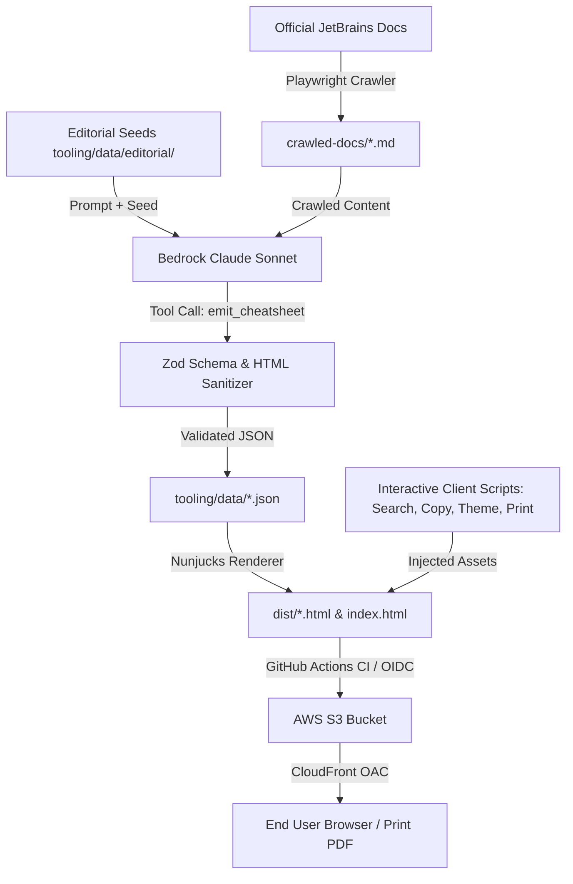

# Requirements

### Overview & Goals
The **JetBrains AI Cheat Sheets** project is an automated documentation pipeline that crawls official JetBrains documentation, distills essential tips, shortcuts, and commands using Claude (via Amazon Bedrock), and renders static HTML cheat sheets hosted on AWS S3 and CloudFront.

This improvement initiative aims to:
1. **Elevate End-User Utility & Interactivity**: Add real-time client-side search, one-click code copying, printable PDF formatting, and theme toggling.
2. **Harden Pipeline Resilience & Data Integrity**: Improve Playwright crawling robustness, add token metrics/diagnostics for extraction, and validate outbound URLs.
3. **Establish Complete QA & CI/CD Tooling**: Fix misconfigured static analysis (`qodana.yaml`), introduce a `vitest` unit/integration test suite, and add PR verification workflows.
4. **Expand Product Catalog**: Broaden coverage to additional JetBrains AI tools with modular configuration and editorial seeds.

---

### Scope

#### In Scope
- **Interactive UX Features**:
  - Live client-side search bar for real-time row/card filtering across cheat sheets and landing page.
  - Interactive "copy to clipboard" buttons for all `<code>` snippets and shortcut labels.
  - Print-to-PDF optimization with dedicated `@media print` rules for clean single/multi-page exports.
  - Theme switching (Dark Terminal vs Light Clean Print).
- **Pipeline & Crawler Hardening**:
  - Controlled concurrency in Playwright crawler (`tooling/src/stages/crawl.ts`) with exponential backoff.
  - Token consumption tracking, cost estimation, and Bedrock latency diagnostics in `tooling/src/stages/extract.ts`.
  - Schema diffing and link validation to detect stale or broken links.
- **Developer Tooling & Testing**:
  - Fixing `qodana.yaml` from JVM to JavaScript/TypeScript linter (`jetbrains/qodana-js`).
  - Vitest test suite covering `schema.ts`, `sanitize.ts`, and `render.ts`.
  - Typecheck (`tsc --noEmit`) and test execution in GitHub Actions CI for PRs.
- **Product Expansion**:
  - Modular addition of new JetBrains AI products (e.g., Datalore AI, Qodana AI) in `tooling/src/config/products.ts` and `tooling/data/editorial/`.

#### Out of Scope
- Migrating the static hosting architecture away from AWS S3 + CloudFront CDK.
- Replacing the core Anthropic Claude Bedrock model integration.
- Runtime backend server deployments (the site remains purely static HTML/CSS/JS).

---

### User Stories
- **As a developer using JetBrains AI**, I want to quickly filter commands and shortcuts using a live search bar and copy snippets with a single click, so I can immediately apply them in my workflow.
- **As a team lead or trainer**, I want to print or save high-density PDF cheat sheets that fit cleanly onto standard paper without awkward page breaks.
- **As a project maintainer**, I want automated unit tests, Qodana JS analysis, and PR build checks so that doc refreshes or template modifications never break the site.
- **As a pipeline operator**, I want visibility into extraction token usage and clear diagnostics when crawling fails, so issues can be resolved rapidly.

---

### Functional Requirements
1. **Live Search**: Client-side filtering input that matches query strings against section titles, labels, and descriptions, hiding non-matching table rows and empty cards dynamically.
2. **Copy Utility**: Clicking any code element or copy icon copies the clean text to the clipboard and provides visual feedback ("Copied!").
3. **Print Optimization**: Clean styling on print media (`@media print`) that forces high-contrast black/white or clean colored text, avoids card breaks (`break-inside: avoid`), and hides unnecessary web navigation chrome.
4. **Theme Toggle**: Switch between Dark Mode (default neon green/dark slate) and Light Mode (crisp white background with high-contrast text).
5. **Automated Testing Suite**: `npm test` runs unit tests for schema validation, HTML sanitation allowlisting, and Nunjucks template rendering.
6. **Data Link Verification**: `npm run check:links` (or pipeline check) verifies all URLs in `data/*.json` return valid HTTP status codes.

---

### Non-Functional Requirements
- **Performance**: Zero external runtime framework dependencies (vanilla JavaScript in templates) ensuring sub-50ms render and instantaneous client-side search.
- **Security**: Strict HTML sanitization allowlist preserved with `sanitize-html`, preventing XSS vulnerabilities from LLM outputs or editorial seeds.
- **Compatibility**: Fully responsive layout supporting screens from mobile (375px) up to 4K displays, plus print formats (A4/Letter).

# Technical Design

### Current Implementation
The repository consists of:
- **`tooling/`**: Node.js/TypeScript pipeline using Playwright (`stages/crawl.ts`), `@anthropic-ai/bedrock-sdk` (`stages/extract.ts`), and Nunjucks (`stages/render.ts`).
- **`tooling/templates/`**: `cheatsheet.njk` (dense multi-column layout) and `index.njk` (landing page).
- **`tooling/data/`**: Extracted JSON (`junie.json`, `aiassistant.json`, `air.json`, `centralconsole.json`) and editorial markdown seeds.
- **`infra/`**: AWS CDK stack defining S3, CloudFront with OAC, and GitHub OIDC deploy role.
- **`qodana.yaml`**: Currently incorrectly configured with `jetbrains/qodana-jvm` and `projectJDK: "26"` despite being a pure TypeScript/Node.js repository.
- **`.github/workflows/cheatsheets.yml`**: Weekly scheduled pipeline and manual workflow dispatch.

---

### Key Decisions
1. **Zero-Dependency Vanilla JS for Interactive UX**:
   - *Decision*: Embed lightweight vanilla JavaScript directly in `cheatsheet.njk` and `index.njk` rather than introducing heavy runtime frontend frameworks (React/Vue).
   - *Rationale*: Keeps generated static HTML fully self-contained, lightning-fast to load, and easy to host on S3/CloudFront.
2. **Vitest as Primary Test Framework**:
   - *Decision*: Adopt `vitest` in `tooling/` for fast ESM-native TypeScript testing.
   - *Rationale*: Works seamlessly with TypeScript without separate build steps and executes schema/template tests in milliseconds.
3. **Qodana JavaScript/TypeScript Profile**:
   - *Decision*: Migrate `qodana.yaml` to `jetbrains/qodana-js` with appropriate Node.js bootstrap scripts.
   - *Rationale*: Provides accurate static code inspection, dependency security checks, and code quality scoring for TypeScript.
4. **Enhanced Resilience in Playwright Crawling**:
   - *Decision*: Maintain Playwright keyless crawling with adaptive retry mechanisms, request pacing, and soft-error pattern matching, augmented with configurable concurrency limits.
   - *Rationale*: Respects JetBrains documentation servers while avoiding sequential bottlenecks.

---

### Architecture Diagram



---

### Proposed Changes

#### 1. Quality Assurance & Static Analysis
- **`qodana.yaml`**:
  - Replace `linter: jetbrains/qodana-jvm:2026.1` with `linter: jetbrains/qodana-js:2024.3`.
  - Add bootstrap script to execute `npm ci` in `tooling/`.
- **`tooling/package.json`**:
  - Add dependencies: `vitest`, `@vitest/coverage-v8`.
  - Add scripts: `"test": "vitest run"`, `"test:watch": "vitest"`, `"typecheck": "tsc --noEmit"`.
- **`tooling/src/__tests__/`**:
  - `schema.test.ts`: Test Zod schema validation, invalid input rejection, and default values.
  - `sanitize.test.ts`: Test XSS protection, allowed tag filtering, and link protocol checks.
  - `render.test.ts`: Test HTML output generation and snapshot integrity.

#### 2. Pipeline Hardening
- **`tooling/src/stages/crawl.ts`**:
  - Add page batching/concurrency control.
  - Add structured logging with success/skip/failure counters.
- **`tooling/src/stages/extract.ts`**:
  - Track input/output tokens and execution duration.
  - Add diagnostic error reporting when model tool calls fail schema validation.

#### 3. Interactive UX in Templates
- **`tooling/templates/cheatsheet.njk`**:
  - Add search input field in the header with hotkey trigger (`/` or `Ctrl+K` / `Cmd+K`).
  - Add click-to-copy handler on `<code>` and `td.k` elements.
  - Add Theme Toggle button (Dark / Light).
  - Add Print button triggering `window.print()` and `@media print` rules.
- **`tooling/templates/index.njk`**:
  - Add live search filtering across product cards and taglines.

#### 4. GitHub Actions CI
- **`.github/workflows/ci.yml`**:
  - Add PR workflow running `typecheck`, `test`, and dry-run build (`npm run build -- --skip-crawl --skip-extract`).

---

### File Structure Changes

```
tooling/
  src/
    __tests__/
      schema.test.ts       # NEW: Zod validation tests
      sanitize.test.ts     # NEW: XSS sanitizer tests
      render.test.ts       # NEW: Template rendering tests
      crawl.test.ts        # NEW: Crawler path matcher tests
    config/
      products.ts          # MODIFIED: Additional product configs
    stages/
      crawl.ts             # MODIFIED: Concurrency & resilience
      extract.ts           # MODIFIED: Token tracking & diagnostics
      render.ts            # MODIFIED: Enhanced template parameters
    schema.ts              # MODIFIED: Search metadata enhancements
    sanitize.ts            # UNCHANGED / HARDENED
  templates/
    cheatsheet.njk         # MODIFIED: Interactive search, copy, theme, print
    index.njk              # MODIFIED: Search filter & refreshed card styles
.github/
  workflows/
    ci.yml                 # NEW: Pull request test & typecheck workflow
    cheatsheets.yml        # MODIFIED: Integrated test runs before publish
qodana.yaml                # MODIFIED: Fixed JS/TS linter config
```

---

### Risks & Mitigations
- **Model Non-Determinism**: Extract stage may output schema variations.
  - *Mitigation*: Forced tool calling with strict Zod validation and committed JSON fallback snapshots.
- **Print Formatting Breakage**: Multi-column masonry layout could break across page boundaries when printing.
  - *Mitigation*: Dedicated `@media print` CSS with `break-inside: avoid;` on cards and column balancing.
- **Writerside DOM Changes**: JetBrains doc UI updates might alter crawler extraction selectors.
  - *Mitigation*: Fallback selector hierarchy and soft-error detection to prevent committing corrupted empty pages.

# Testing

### Validation Approach
Verification of the proposed improvements will be conducted across unit testing, integration tests, static analysis, and manual browser checks.

---

### Key Scenarios

1. **Schema Validation & Sanitization Tests**:
   - Validate that valid cheat sheet JSON conforms to `CheatSheetSchema`.
   - Validate that malicious HTML (e.g., `<script>`, ``, `javascript:`) is stripped by `sanitizeInline`.
   - Validate that only authorized `jetbrains.com` domains are permitted for `docsUrl`.

2. **Template Rendering & Snapshot Tests**:
   - Render `junie.html`, `aiassistant.html`, `air.html`, and `centralconsole.html` from mock data.
   - Verify that generated HTML contains all expected sections, color classes, and valid DOM structures.

3. **Client-Side Interactivity**:
   - Test search filtering: typing "git" shows only git-related rows and sections; clearing search restores full view.
   - Test copy-to-clipboard: clicking a code snippet triggers clipboard write and displays the "Copied!" indicator.
   - Test theme toggle: toggling switches CSS classes and updates localStorage preference.
   - Test print styling: verify print preview displays clean multi-column layout without overlapping elements.

4. **CI/CD & Qodana Static Analysis**:
   - Verify `npx vitest run` passes 100% with zero test failures.
   - Verify `tsc --noEmit` reports zero TypeScript compiler errors.
   - Verify Qodana JS linter executes cleanly without JVM configuration errors.

---

### Edge Cases
- **Empty Search Query**: Restores all cards and rows without layout flickering.
- **No Matching Search Results**: Displays a clean "No matching shortcuts found" message.
- **Crawler Rate Limiting (HTTP 429/503)**: Verified that retry exponential backoff engages and falls back to committed markdown snapshot on exhaustion.
- **Bedrock Token Limit Exceeded**: Validated that large markdown files are appropriately truncated or chunked before prompting.

# Delivery Steps

###   Step 1: Quality Assurance, Testing & Static Analysis Setup
Establish modern linting, TypeScript checking, test runner infrastructure, and fix static analysis configuration.

- Fix `qodana.yaml` by replacing the incorrect JVM linter (`jetbrains/qodana-jvm`) with the TypeScript/JavaScript linter (`jetbrains/qodana-js`) and adding proper bootstrap commands.
- Install `vitest` and `@types/node` test utilities in `tooling/package.json` with npm test scripts.
- Implement automated unit and regression tests for `tooling/src/schema.ts` and `tooling/src/sanitize.ts` to verify security boundaries, allowlisted tags, attribute stripping, and schema validation.
- Add test coverage for `tooling/src/stages/render.ts` validating template compilation, variable interpolation, and snapshot fidelity across all configured products.
- Add CI verification step in `.github/workflows/cheatsheets.yml` (and dedicated PR check workflow) to execute typecheck and test suite on pull requests.

###   Step 2: Pipeline Resilience & Extraction Hardening
Enhance the Playwright crawler and Bedrock Claude extraction engine for better reliability, concurrency, and diagnostics.

- Refactor `tooling/src/stages/crawl.ts` to support controlled concurrency (batching page fetches) while respecting politeness delays and retry backoff.
- Improve error classification in `looksLikeError` and add DOM-ready waiting strategies for dynamic JetBrains Writerside single-page applications.
- Update `tooling/src/stages/extract.ts` to log token usage metrics, Bedrock invocation latency, and detailed schema validation errors.
- Implement link verification helper that validates all outbound URLs in extracted JSON against live/expected JetBrains docs endpoints.
- Add a data integrity script (`npm run check:data`) to detect regressions and schema deviations in `tooling/data/*.json`.

###   Step 3: Interactive UX & Cheat Sheet Rendering Enhancements
Upgrade Nunjucks templates and client-side assets to deliver instant search, snippet copying, theme switching, and print-optimized PDF styling.

- Implement client-side interactive search and filtering in `tooling/templates/cheatsheet.njk` and `tooling/templates/index.njk` to filter rows and section cards by keyword, command, or concept in real time.
- Add one-click copy-to-clipboard buttons next to code elements and labels with visual feedback tooltip states.
- Enhance print stylesheets (`@media print`) for high-density multi-column paper/PDF export (preventing orphan cards and styling cleanly for A4/Letter formats).
- Add light/dark theme toggle support across templates, ensuring maximum readability both in terminal-style dark mode and printable light mode.
- Update `dist/index.html` landing page to display interactive product cards, search bar across all cheatsheets, and direct PDF download/print triggers.

###   Step 4: Product Expansion & CI/CD Automation
Expand the product configuration catalog, update editorial seeds, and configure preview workflows.

- Add configuration entries in `tooling/src/config/products.ts` for additional JetBrains AI offerings (e.g. JetBrains Datalore AI, Qodana AI / Space AI).
- Create corresponding editorial seeds in `tooling/data/editorial/` with tailored voice and section blueprints.
- Add GitHub Actions PR preview workflow or artifact upload to verify rendered static HTML before merge.
- Update `README.md` and documentation with updated CLI commands, testing instructions, and product extension guides.